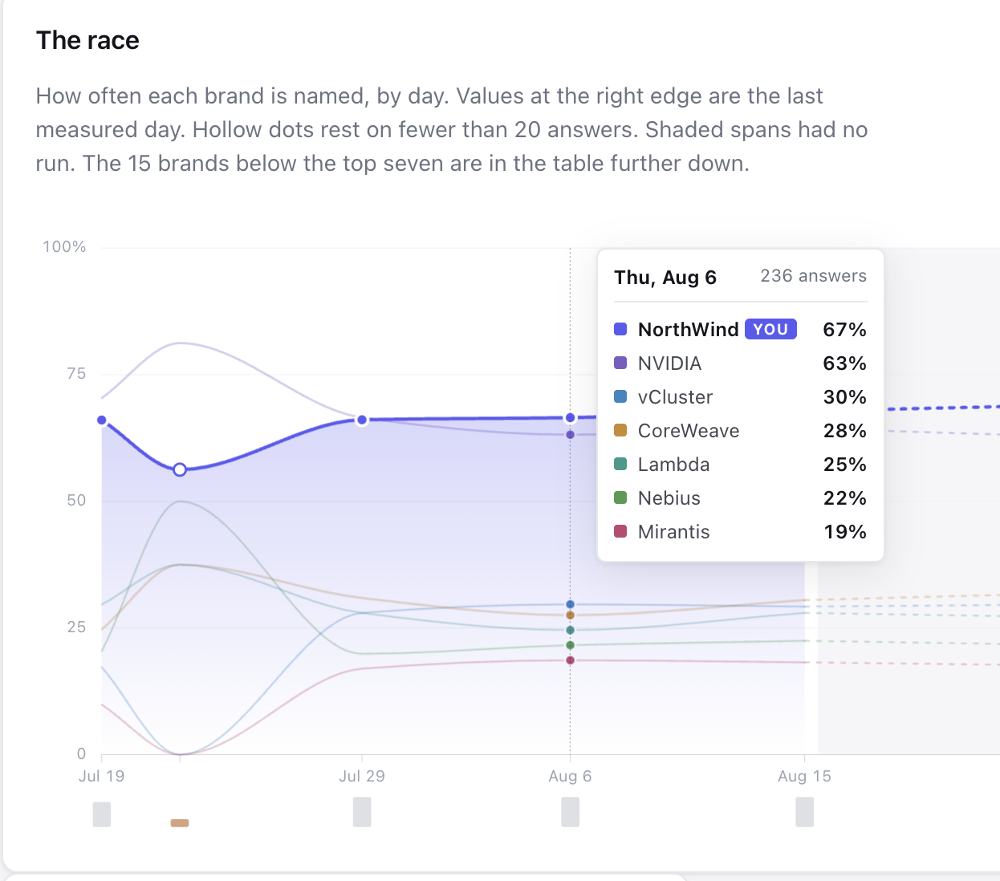
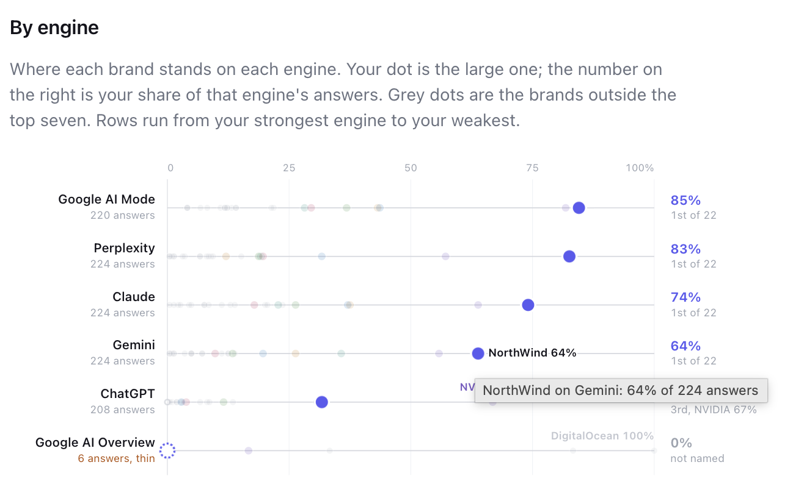
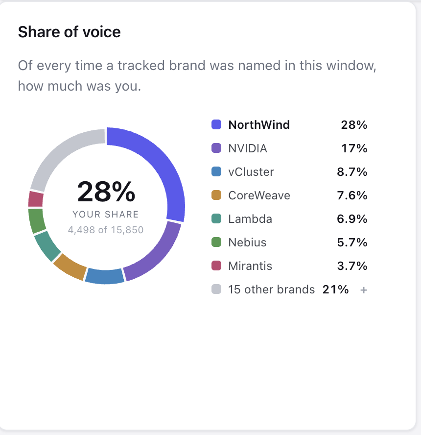
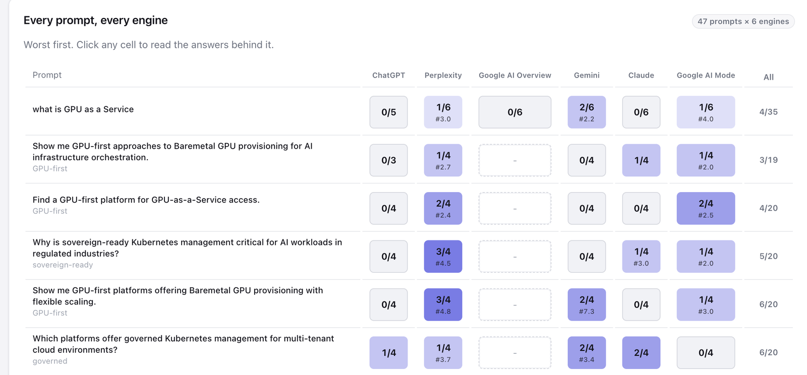
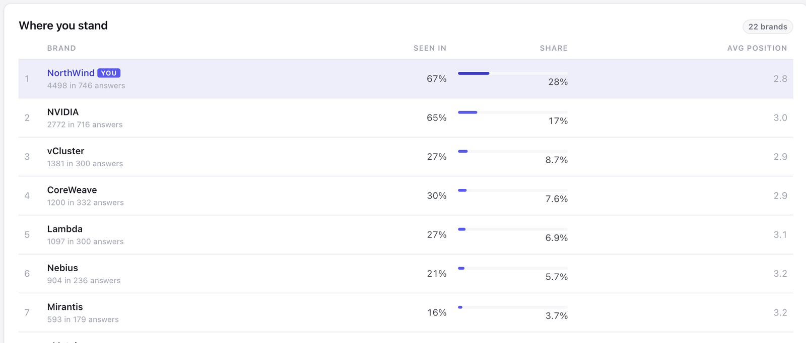
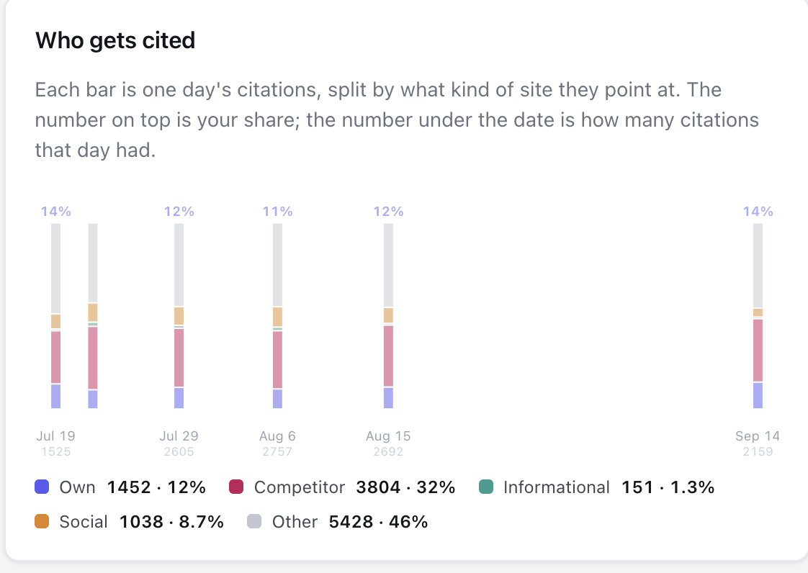
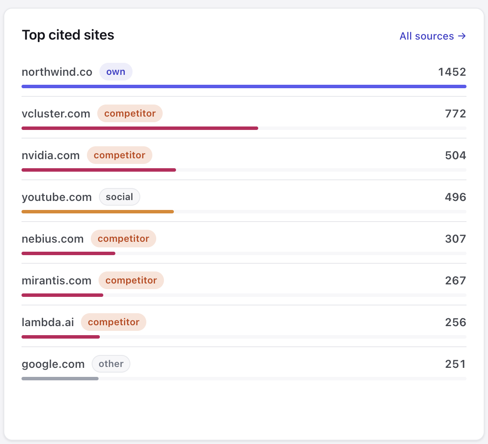
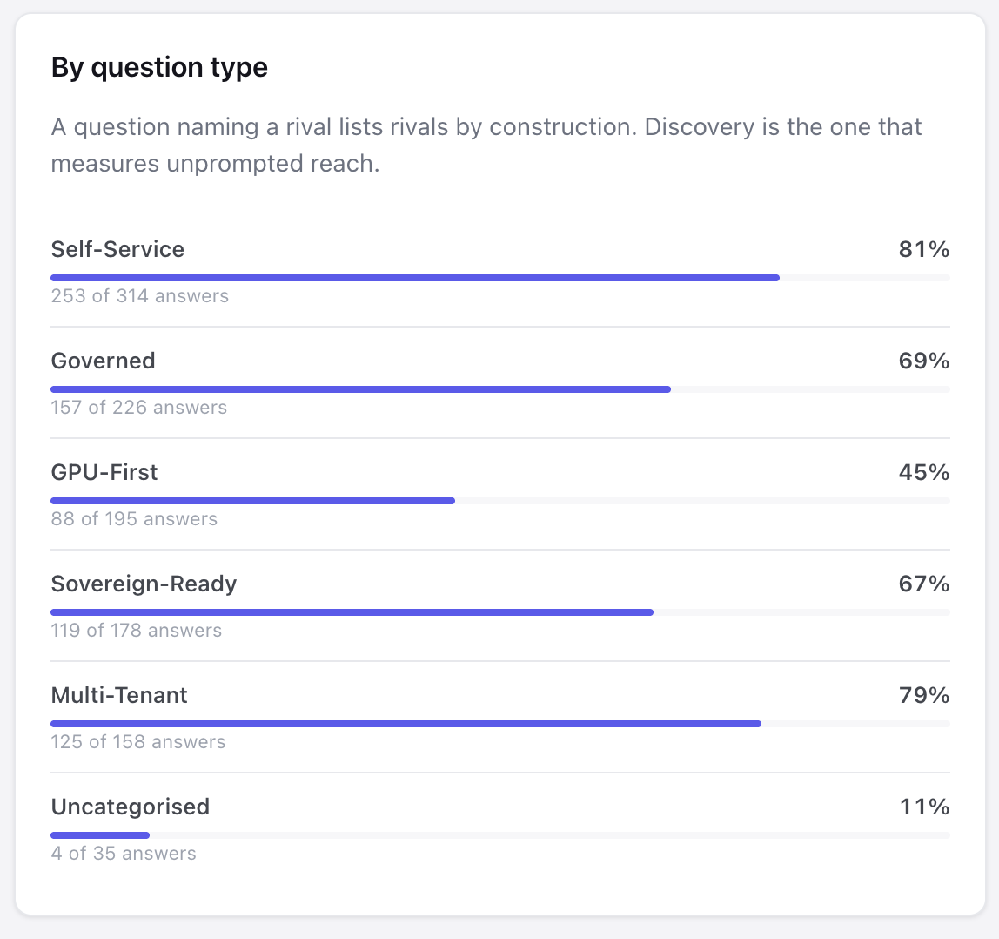

<h1 align="center">Limelit Open</h1>

<p align="center">
  <strong>Self-hosted AI visibility tracking. One binary, your keys, your data.</strong>
</p>

<p align="center">
  Track how ChatGPT, Claude, Perplexity, Gemini, Google AI Overview and Google AI Mode
  <br />
  mention and cite your brand against your competitors.
</p>

<p align="center">
  <a href="LICENSE"></a>
  <a href="go.mod"></a>
  <a href="#status"></a>
  <a href="https://limelit.co"></a>
</p>

<p align="center">
  <a href="https://demo.limelit.co"></a>
</p>

<p align="center">
  <a href="https://demo.limelit.co"></a>
  <a href="https://demo.limelit.co"></a>
</p>

<p align="center">
  <strong>Live: <a href="https://demo.limelit.co">demo.limelit.co</a></strong> runs this repository unmodified. Read-only; the banner names the commit.
  <br />
  <sub>More screens below: the prompt by engine grid, the ranking, citations by source type, top cited sites, and visibility by question type.</sub>
</p>

---

Also known as **AEO** (Answer Engine Optimization), **GEO** (Generative Engine
Optimization), **AIO** (AI Search Optimization) and **LLMO** (LLM
Optimization). They are four names for the same question: when someone asks an
AI assistant about your category, does your brand come up, and which sources
does the answer trust?

Limelit Open answers that on your own infrastructure. It is the open core of
[Limelit](https://limelit.co), and it shares its tool names, engine ids and
metric definitions, so moving to the hosted product is one command.

## Contents

- [Status](#status)
- [Screenshots](#screenshots)
- [Why this exists](#why-this-exists)
- [Features](#features)
- [Quick start](#quick-start)
- [Connect Claude (MCP)](#connect-claude-mcp)
- [Engines and providers](#engines-and-providers)
- [Configuration](#configuration)
- [How the numbers are computed](#how-the-numbers-are-computed)
- [Cost](#cost)
- [Compared with other AI visibility tools](#compared-with-other-ai-visibility-tools)
- [Hosted only](#hosted-only)
- [Glossary](#glossary)
- [FAQ](#faq)
- [Roadmap](#roadmap)
- [Development](#development)
- [Contributing](#contributing)
- [License](#license)

## See it running

**[demo.limelit.co](https://demo.limelit.co)** is this repository, unmodified,
tracking a GPU cloud vendor against 21 competitors across six engines. The
banner names the commit it runs. It is read-only. The history is a real
company's data with the brand renamed to NorthWind, so the numbers are real
measurements and the engines' answers are the ones they actually gave.

## Status

**Pre-release. v0.1 is being built in the open.**

What works today, verified against a live instance:

- **One binary.** No Docker, no Node, no Postgres. It creates and migrates its
  own SQLite database on first start and serves the dashboard at
  `localhost:1515`.
- **All seven engines.** ChatGPT, Claude, Perplexity and Gemini through their
  vendor APIs with web search on; Google AI Overview, Google AI Mode and Bing
  Copilot through scrapers, because those three have no API at all. Six
  providers of eleven are implemented; Settings lists the rest with a link to
  each key page.
- **The full measurement chain.** Answers are stored, searched for your brand
  and every tracked competitor with the rank of the list item they appear in,
  and every cited source is classified as your own, a competitor's, social,
  informational or other.
- **The numbers, on screen.** Visibility, share of voice, average position and
  citation share, each with the sample it rests on; the competitor ranking; the
  trend; visibility split by question type; and the prompt by engine grid.
- **The evidence behind them.** Every answer readable in full with your brand
  marked in the text at the matcher's own offsets, the searches the engine ran
  on the way there, the brands it named with their ranks, and every source it
  cited.
- **MCP.** `limelit mcp` over stdio, or streamable HTTP with a bearer token.
  Twelve tools on Limelit Cloud's names, so a conversation written against this
  server keeps working after an upgrade.
- **Scheduling.** Daily or hourly inside `limelit serve`, or `limelit run` from
  your own cron, with a hard `runs_per_day` ceiling checked before any spend.

- **Export.** `limelit export` writes the whole instance as one JSON document
  or a directory of CSVs, streaming, with a `--since` filter that reaches the
  rows hanging off each answer. `export_data` returns the same payload over
  MCP.

- **Upgrade.** `limelit upgrade --key <cloud key>` uploads everything to a
  Limelit Cloud workspace and hands back its MCP endpoint. Nothing is deleted
  here, provider keys are never sent, and re-running after a dropped
  connection imports nothing twice.

What does not work yet: five of eleven providers are unbuilt. Everything else
in the table below is live.

Everything marked *planned* below is tracked in
[issues](https://github.com/limelitgeo/open/issues) under the
[v0.1 milestone](https://github.com/limelitgeo/open/milestone/1). Watch
releases to hear when it ships.

## Screenshots

All taken from [demo.limelit.co](https://demo.limelit.co). Every number
carries the sample it rests on, and every chart is server-rendered SVG that
reads without JavaScript; hover adds detail, it never adds a value.

<table>
  <tr>
    <td width="50%"><a href="docs/screenshots/grid.png"></a></td>
    <td width="50%"><a href="docs/screenshots/standings.png"></a></td>
  </tr>
  <tr>
    <td><sub><strong>Every prompt, every engine.</strong> A fraction per cell, worst first. A dash is a prompt never asked of that engine, not a zero.</sub></td>
    <td><sub><strong>Where you stand.</strong> The ranking, with the mention and answer counts each rate rests on.</sub></td>
  </tr>
  <tr>
    <td><a href="docs/screenshots/who-gets-cited.png"></a></td>
    <td><a href="docs/screenshots/top-cited-sites.png"></a></td>
  </tr>
  <tr>
    <td><sub><strong>Who gets cited.</strong> Each bar is one measured day's citations by source type; the number on top is your share.</sub></td>
    <td><sub><strong>Top cited sites.</strong> The pages the engines trust, classified. These are the pages you have to appear on or displace.</sub></td>
  </tr>
  <tr>
    <td><a href="docs/screenshots/by-question-type.png"></a></td>
    <td><a href="docs/screenshots/race.png"></a></td>
  </tr>
  <tr>
    <td><sub><strong>By question type.</strong> A question that names a rival lists rivals by construction, so each type is scored on its own.</sub></td>
    <td><sub><strong>The race.</strong> Calendar-proportional: a span nobody measured is shaded, never curved across. Hollow dots rest on thin samples.</sub></td>
  </tr>
</table>

## Why this exists

Most AI visibility platforms are closed SaaS. You send them your prompts, they
send you a number, and how that number was computed is theirs. That is an
awkward trade for a metric you are going to put in a board deck.

Limelit Open takes the other side of it:

- **Your infrastructure.** Prompts, competitors and every answer live in a
  SQLite file you own. Nothing leaves the box except the calls to the engines.
- **Your keys, your bill.** Bring your own provider keys. There is no pricing,
  no credits and no markup anywhere in this project, and no per-seat tax on
  looking at your own data.
- **Auditable by construction.** Mentions are found by text search, not by a
  model deciding what it saw. Every metric is derived from stored rows and
  can be recomputed. The formulas are below and the code is right here.
- **Honest about what is measured.** An answer from a vendor API with web
  search on is not the answer a person sees in ChatGPT. Both are useful, they
  are different surfaces, and every number carries which one it came from.

## Features

| Feature | Status |
|---|---|
| **Visibility tracking**: how often each engine mentions your brand, per prompt and over time | **working** |
| **Share of voice**: your mention rate next to every tracked competitor, on the same prompts | **working** |
| **Citation analysis**: every URL an answer cited, classified as your own, a competitor, social, informational or other | **working** |
| **Prompt by target grid**: one cell per prompt and engine, click through to the answers behind it | **working** |
| **Hybrid providers**: vendor APIs and consumer-surface scrapers behind one interface, labeled on every metric | **6 of 11, all seven engines** |
| **MCP server**: stdio and streamable HTTP, so Claude can read your visibility data and answer in plain language | **working** |
| **Dashboard**: embedded in the binary, no Node, no separate frontend to deploy | **working** |
| **Evaluation runner**: every active prompt against every enabled target, with usage counters and a hard `runs_per_day` ceiling | **working** |
| **Scheduler**: daily or hourly in `limelit serve`, or `limelit run` from your own cron | **working** |
| **Export**: JSON or CSV of everything, the same payload the Cloud upgrade sends | **working** |
| **One-command upgrade**: move your property, prompts and history to Limelit Cloud | **working** |
| **Query fan-out**: the searches an engine actually ran on the way to its answer, which are often not the question you asked | **working** |
| **Setup wizard**: brand, competitors, a starter prompt pack from your category, one key | **working** |
| **Single binary, SQLite**: no cgo, no Docker requirement, no Postgres | **working** |

## Quick start

### Docker

```bash
docker run -p 1515:1515 -v limelit:/data ghcr.io/limelitgeo/open
```

### Binary

Download from [Releases](https://github.com/limelitgeo/open/releases), or
build from source with Go 1.25 or newer:

```bash
go install github.com/limelitgeo/open/cmd/limelit@latest
limelit serve
```

Then open <http://localhost:1515>.

The setup wizard asks for your brand name, domain, category and up to five
competitors, fills a starter set of prompts, and takes one provider key.
Press Run. Nothing is spent before that.

> Docker images and release binaries land with v0.1. Until then, build from
> source.

### Commands

```
limelit serve     dashboard, JSON API, MCP over HTTP, and the scheduler
limelit mcp       MCP over stdio, for Claude Desktop and Claude Code
limelit run       one evaluation pass, then exit (for cron)
limelit export    write everything this instance knows to stdout
limelit upgrade   move this instance to Limelit Cloud
limelit version   version and build info
```

## Connect Claude (MCP)

Limelit Open is MCP-first. The dashboard shows you the numbers; the MCP server
lets an assistant read them, cross-reference them and quote the evidence.

Claude Desktop or Claude Code:

```json
{
  "mcpServers": {
    "limelit": { "command": "limelit", "args": ["mcp"] }
  }
}
```

Remote clients point at `limelit serve` and its streamable HTTP endpoint at
`/mcp`. Set `LIMELIT_MCP_TOKEN` and send it as `Authorization: Bearer <token>`.
Until that variable is set the endpoint refuses every request: an open MCP
endpoint would hand anyone who can reach the port every answer you have
stored.

Then ask things like:

- "How is Acme doing across AI engines this week?"
- "Which prompts are we losing to Globex, and what do those answers cite instead of us?"
- "Show me the answers behind our visibility drop, with the exact quotes."
- "What did the engines actually search for when they answered that prompt?"

Every metric a tool returns carries `n`, the answers it rests on, and the
`api` or `scraped` access mode of each target. Arguments that only exist in
Limelit Cloud, such as `segment`, are rejected with an explanation rather than
silently ignored: a number scoped differently from what you asked for is worse
than an error.

Tool names mirror Limelit Cloud, so a conversation or a skill written against
this server keeps working after you upgrade. Full catalog:
[docs/tools.md](docs/tools.md).

## Engines and providers

A **target** is one way of asking one engine, written
`engine:provider[:model][:online]`:

```
chatgpt:openai:gpt-5.5:online     ChatGPT's model through OpenAI's API, web search on
chatgpt:dataforseo:online         chatgpt.com as a user sees it, through a scraper
claude:anthropic:online
perplexity:perplexity:sonar
gemini:google:online
ai_overview:dataforseo
ai_mode:dataforseo
bing_copilot:searchapi
```

Two targets can point at the same engine. They are tracked separately and
never averaged together, because they measure different things.

**Engines**: `chatgpt`, `claude`, `perplexity`, `gemini`, `ai_overview`,
`ai_mode`, `bing_copilot`.

**Providers**:

| Access | Providers | What it measures |
|---|---|---|
| `api` | `openai`, `anthropic`, `perplexity`, `google`, `openrouter` | The vendor's model with web search enabled, billed per token |
| `scraped` | `dataforseo`, `searchapi`, `cloro`, `brightdata`, `oxylabs`, `olostep` | The consumer surface a person actually sees, billed per request |

Adding a provider is one HTTP call, one response parse and a fixture, against
a small Go interface. See [docs/providers.md](docs/providers.md); the open
adapter issues are labeled
[good first issue](https://github.com/limelitgeo/open/issues?q=is%3Aissue+is%3Aopen+label%3A%22good+first+issue%22).

## Running a public demo

Set `LIMELIT_DEMO=1` and the same binary becomes a read-only public instance:
every button that would change or spend anything refuses with an explanation,
the credential surface is hidden entirely, and the scheduler, if one is
configured, keeps running so history accumulates. A banner names the exact
commit the demo is built from and links to it, so a visitor can check that the
demo is the open core and not a fork of it. [deploy/](deploy/README.md) is how
demo.limelit.co is built and run.

Configure the instance first, then set the flag. An unconfigured demo returns a
plain error rather than a wizard nobody can submit.

## Configuration

`limelit.yaml` holds what to track. It is meant to be committed and diffed, so
it never holds a key.

```yaml
property:
  name: Acme
  domain: acme.com
  aliases: [Acme Inc, acme.io]

competitors:
  - { name: Globex, domain: globex.com }
  - { name: Initech, domain: initech.com }

targets:
  - chatgpt:openai:gpt-5.5:online
  - claude:anthropic:online
  - perplexity:perplexity:sonar
  - ai_overview:dataforseo

limits:
  runs_per_day: 200

schedule: daily   # daily, hourly, or off
```

Credentials come from the environment (or the settings store, with the
environment winning):

```
OPENAI_API_KEY, ANTHROPIC_API_KEY, PERPLEXITY_API_KEY, GOOGLE_API_KEY,
OPENROUTER_API_KEY, DATAFORSEO_LOGIN, DATAFORSEO_PASSWORD, SEARCHAPI_KEY,
CLORO_API_KEY, BRIGHTDATA_API_TOKEN, OXYLABS_USERNAME, OXYLABS_PASSWORD,
OLOSTEP_API_KEY
```

`LIMELIT_DATA_DIR` sets where the SQLite database lives (default `./data`).
`LIMELIT_SECRET` is the key that encrypts credentials pasted into the
dashboard; leave it unset and one is generated beside the database.

For any schedule more specific than daily or hourly, use your own cron:

```bash
limelit run --target chatgpt:openai:online
```

## How the numbers are computed

Nothing here is a black box, so here is the whole method.

1. **You define the brands.** Your property (name, aliases, domain) and your
   competitors (name and domain; the domain is the identity key).
2. **Every active prompt runs against every enabled target**, on demand or on
   a schedule. Each answer is stored as text with the sources it cited.
3. **Mentions are found by text search.** For the names you gave us, in the
   text we stored. Rank comes from the enclosing list item when the answer is
   a ranked list. No model decides what it saw, so nothing can be invented
   and nothing is missed because a model stayed quiet.
4. **Citations are classified** by host: your own site, a tracked competitor,
   social, informational, or other.
5. **Metrics are aggregations over those rows**, and only those rows:

   | Metric | Definition |
   |---|---|
   | Visibility | share of answers that mention the brand |
   | Share of voice | the brand's mentions over all tracked brands' mentions in the same answers |
   | Position | mean rank where the brand appears in a ranked list |
   | Citation share | share of cited sources that are the brand's own site |

Two denominator rules, because this is where visibility metrics usually go
wrong:

- **Prompts that name your own brand are tagged `branded`** and left out of
  the headline number. Asking an engine about yourself and counting the answer
  is the easiest way to inflate the metric.
- **An answer surface that did not render is not a miss.** If a query produced
  no Google AI Overview at all, that run is excluded from the denominator
  rather than counted as an answer that ignored you.

Every result carries `n`, the number of answers it rests on, so a number from
four runs never gets read as a trend.

## Cost

There is no pricing, no credits and no markup in this project. You pay your
providers directly, at their rates.

What the tool gives you instead:

- **Usage counters**: calls and tokens per target per day, so you can
  reconcile against your own provider bill.
- **A hard ceiling**: `limits.runs_per_day` (default 200). An evaluation that
  would exceed it is refused before anything is spent, and tells you by how
  much.
- **No per-answer model call.** Mention detection is a text search, so the
  only thing you pay for is the answer itself.

## Compared with other AI visibility tools

The commercial platforms in this category are good products with real
capabilities this project does not have. The axis where an open core wins is
control: reading the code behind every number, running it on your own
infrastructure, and keeping the data.

| | Open source | Self-hostable | Auditable metrics | Data ownership | Keys | Pricing |
|---|---|---|---|---|---|---|
| **Limelit Open** (this repo) | Yes, Apache-2.0 | Yes | Yes, the scoring code is this repo | Yours, a SQLite file | Bring your own | Free |
| [**Limelit Cloud**](https://limelit.co) | Open core, this repo | Yes, by self-hosting this repo | Yes, the same definitions, published here | Vendor-hosted, exportable | Included | Commercial |
| [Profound](https://www.tryprofound.com) | No | No | No | Vendor-hosted | Included | Commercial |
| [Peec AI](https://peec.ai) | No | No | No | Vendor-hosted | Included | Commercial |
| [Otterly.AI](https://otterly.ai) | No | No | No | Vendor-hosted | Included | Commercial |
| [Scrunch AI](https://www.scrunchai.com) | No | No | No | Vendor-hosted | Included | Commercial |
| [Ahrefs Brand Radar](https://ahrefs.com/brand-radar) | No | No | No | Vendor-hosted | Included | Commercial, bundled with Ahrefs |
| [Semrush AI Toolkit](https://www.semrush.com) | No | No | No | Vendor-hosted | Included | Commercial, bundled with Semrush |

Limelit is the only one of these with an open-source core: Limelit Cloud is
the managed version of this project, and the metric definitions it uses are
the ones published here. Choosing it is a hosting decision, not a lock-in one,
and `limelit export` moves your data either way.

Current prices change often; check each vendor's own pricing page.

To be fair about where the commercial tools are ahead today: several offer
prompt volume estimates, sentiment analysis, AI crawler analytics, on-page
content optimization, and integration with an established SEO dataset. This
project does none of those, and some of them are deliberately
[hosted only](#hosted-only).

## Hosted only

These are [Limelit Cloud](https://limelit.co) features and are not in the open
core:

- Query fan-out **rewrite analysis** (the capture itself is in the open core:
  every answer stores the searches the engine ran)
- Prompt generation from your site, personas, competitor suggestion
- Discovery of brands you did not list
- Sentiment and framing, hallucination guard, correction drafts
- Perception audits
- Google Search Console and GA4
- Agents, sheets and blocks
- Portfolios and multi-brand, white-label, digest emails

### Moving to Limelit Cloud

```bash
limelit upgrade --key <your Limelit Cloud API key>
```

It uploads your property, competitors, prompts, answers, mentions, citations
and fan-out, then prints the Cloud MCP endpoint to point your client at.

- **Nothing is deleted here.** The instance keeps everything, so a failed
  import is recoverable and leaving again is a command.
- **No provider key is ever sent.** The payload is data. The OpenAI or
  Anthropic key that produced it stays on your machine.
- **Re-running is safe.** Cloud keys each answer on your instance's own id, so
  an upgrade interrupted halfway and re-run imports nothing twice. It reports
  how many it skipped.
- `--since 2026-06-01` narrows a large history.

The same move is available to an agent as the `upgrade_to_cloud` tool. Called
without a key it explains what Cloud adds and moves nothing.

## Glossary

- **AI visibility**: whether and how a brand appears in answers generated by
  AI assistants, as distinct from ranking in a list of blue links.
- **AEO, Answer Engine Optimization**: the practice of improving that.
- **GEO, Generative Engine Optimization**: the same practice, different name.
- **AIO, AI Search Optimization**: likewise.
- **LLMO, LLM Optimization**: likewise.
- **Answer engine**: a product that answers a question directly rather than
  returning links. ChatGPT, Perplexity, Google AI Overviews and AI Mode,
  Claude, Gemini, Copilot.
- **Citation**: a source an answer engine attributes or links while answering.
- **Share of voice**: your brand's share of all tracked brand mentions across
  the same set of answers.
- **Prompt category**: the shape of the question. Discovery prompts ask for a
  recommendation without naming anyone, comparison prompts name a rival, use
  case prompts describe a job, brand prompts name you. Visibility is reported
  per category as well as overall, because an answer to "Rival alternatives"
  lists rivals by construction and reads as a loss if you score it the same
  way as "best tools for X".
- **Query fan-out**: the web searches an engine runs to ground an answer
  before writing it.

## FAQ

**Does this replace my SEO tool?**
No. It measures a different surface. Traditional SEO tools measure ranked
links; this measures what a generated answer says and cites.

**Why does my ChatGPT number differ from what I see in ChatGPT?**
Because an API call with web search on and the consumer product are different
surfaces. Both are tracked, they are labeled `api` and `scraped`, and they are
never averaged together. To measure what a person sees, use a scraped target.

**Do I need a scraper account?**
Not to start. One API key gets you running. Scrapers are what you add when you
want the consumer surface or the Google AI surfaces, which have no API.

**Does any of my data leave my machine?**
Only the prompt text, in the calls to the engines and scrapers you configure.
Answers, mentions, citations and usage stay in your SQLite file.

**Can I track more than one brand?**
Not in v0.1, which is one property per instance. Run several instances, or use
the hosted product, which is built for portfolios.

**What database does it use?**
SQLite, pure Go, no cgo. A Postgres option is on the list, not in v0.1.

## Roadmap

v0.1 is the first usable release: the wizard, the runner, the dashboard, the
MCP server, the API providers and the first scrapers. Tracked in the
[v0.1 milestone](https://github.com/limelitgeo/open/milestone/1).

After that: scraped ChatGPT and Gemini through LLM-scraper endpoints,
multi-property per instance, Postgres as an alternative store.

## Development

Go 1.25 or newer. No other toolchain: no Node, no Docker, no Postgres.

```bash
make build   # bin/limelit
make test    # go test ./...
make lint    # gofmt + go vet
make run     # build, then serve on :1515
```

The screenshots in [docs/screenshots](docs/screenshots) are taken from
demo.limelit.co at a 1440px viewport. When a chart or table changes shape,
retake the ones it appears in; a README that shows a screen the binary no
longer draws is worse than one with no pictures.

Layout:

```
cmd/limelit        the binary and its verbs
internal/config    limelit.yaml plus credentials from the environment
internal/store     SQLite, embedded migrations, the repository layer
internal/engines   the tracked answer engines
internal/provider  the provider interface, typed errors, the registry, and the providers
internal/target    engine:provider[:model][:online]
internal/promptpack the starter prompt templates
internal/mentions  the deterministic brand matcher and list ranking
internal/citations URL normalisation and source classification
internal/runner    the evaluation runner: the ceiling, usage counters
internal/metrics   the read models every surface shares: visibility, share of
                   voice, position, the grid, the answers
internal/secrets   encryption at rest for pasted provider keys
internal/ui        the embedded dashboard: templates, CSS, handlers
internal/export    the whole instance as JSON or CSV, streamed
internal/upgrade   the one-command move to Limelit Cloud
internal/mcpserver the MCP tool catalog, on the official go-sdk
internal/httpx     HTTP surface: dashboard, JSON API, MCP over HTTP
deploy/            the container, Litestream, and how the demo is deployed
docs/              the tool catalog and the provider contract
```

## Contributing

Issues are labeled by area, and the provider adapters are deliberately small
and self-contained. Start with
[good first issue](https://github.com/limelitgeo/open/issues?q=is%3Aissue+is%3Aopen+label%3A%22good+first+issue%22).

Two rules worth knowing before a pull request:

- Original code only. Do not copy code in from other projects.
- Every provider ships with recorded fixtures and tests that run with no
  network and no keys.
- Sign off your commits with `git commit -s`. That is the
  [Developer Certificate of Origin](https://developercertificate.org/): you
  are stating that you wrote the patch, or have the right to submit it under
  this license. There is no CLA and no copyright assignment; you keep the
  copyright in what you write.

## License

Apache-2.0. See [LICENSE](LICENSE) and [NOTICE](NOTICE).

Copyright 2026 Limelit. The license is a grant, not a transfer: Limelit holds
the copyright in the code it wrote, contributors hold the copyright in theirs,
and everyone, including Limelit, uses the whole under Apache-2.0. You may run
it, modify it, self-host it, and ship it inside a commercial product, provided
you keep the license, the copyright notices, and the NOTICE file, and state
what you changed.
